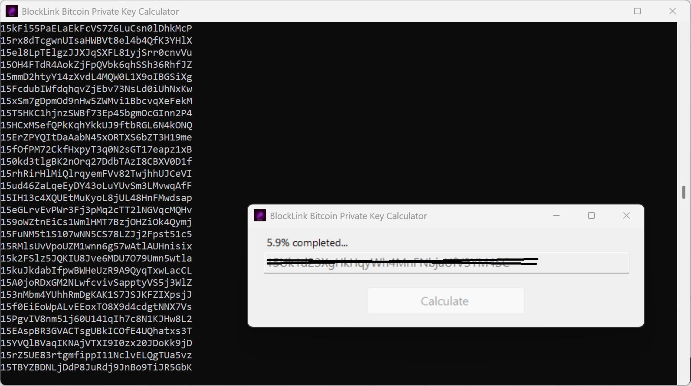

# BlockLink-Bitcoin-Private-Key-Calculator-Final
BlockLink is a powerful Windows application that calculates and displays the private keys and seed phrases for any Bitcoin address, providing deep insight into Bitcoin wallet security and key generation.

BlockLink is a specialized Windows application designed for cryptocurrency enthusiasts, developers, and security researchers. It provides a unique window into the cryptographic foundations of Bitcoin by allowing users to calculate and visualize the private keys and hierarchical deterministic (HD) wallet seed phrases associated with Bitcoin addresses.

 
This tool is intended for educational and auditing purposes to help users understand the critical relationship between a private key, its corresponding public address, and the master seed. By inputting specific key generation data, BlockLink can display the resulting private key in various formats (WIF, Hex) and the BIP39 mnemonic seed phrase.

Important Disclaimer: This application is a demonstration tool. It is not designed to, and cannot, "crack" or find the private key for a random, live Bitcoin address on the blockchain. It is intended for use with keys and seeds you already control or are generating in a test environment. BlockLink emphasizes the importance of safeguarding your private keys, as anyone who possesses them has complete control over the associated funds.

Key Features:

✅ Calculate Private Keys from Entropy/Seed

✅ Display BIP39 Mnemonic Seed Phrases

✅ Show Keys in WIF & Hex Formats

✅ User-Friendly Windows Interface

✅ Ideal for Learning and Testing

